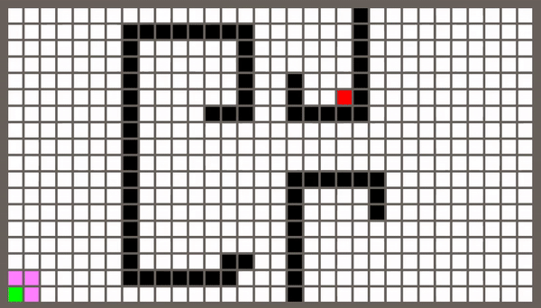

# Pathfinding

A simple pathfinding project in Unity created under Wilmer Lin's [course](https://www.udemy.com/course/pathfinding-in-unity/).

## About

In this project next pathfinding algorithms were implemented:

- Breadthfirst search
- Greedy Best First
- Dijkstra
- A*

You can use `.txt` file as a map or even `.psd`.

The import settings for `.psd` are next:

- Advanced
  - Non-Power of 2 - None
  - Read/Write Enabled - True
  - Generate Mip Maps - False
  - Filter Mode - Point (no filter)

## Demonstrations

- Breadthfirst search

- Greedy Best First

- Dijkstra

- A*

